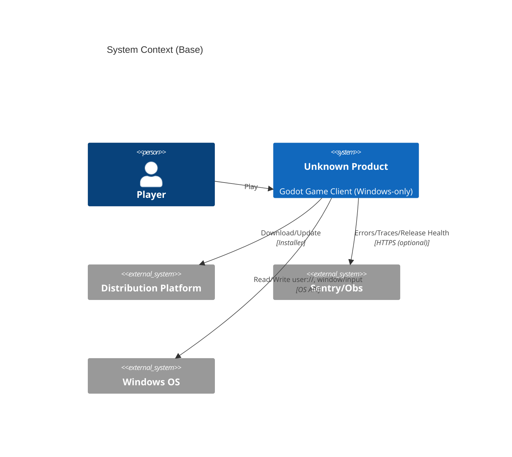
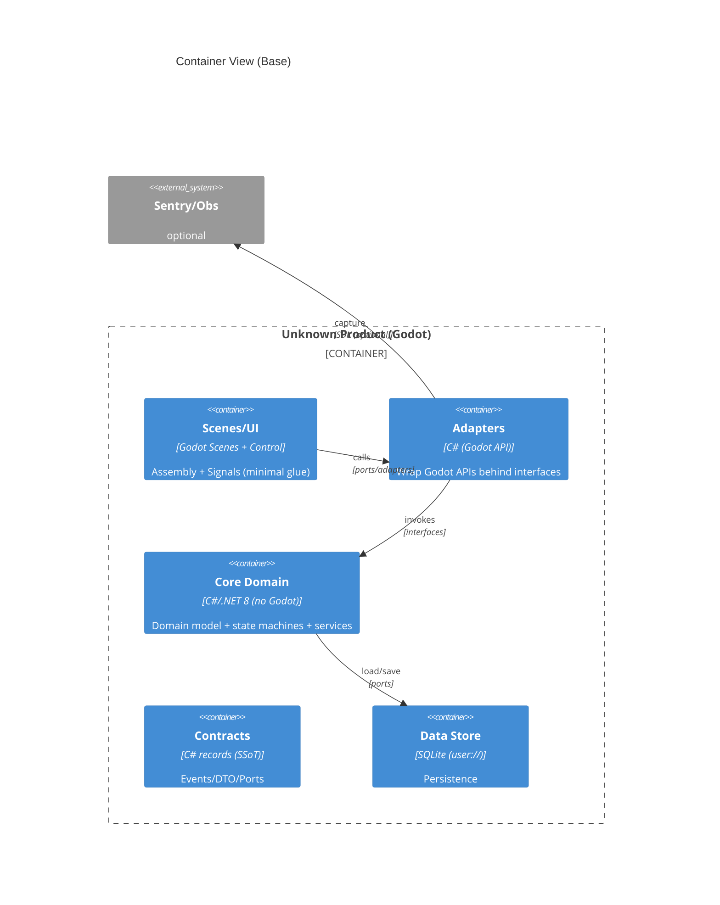
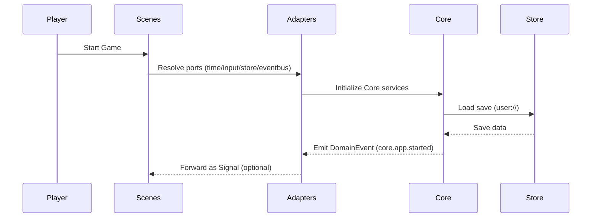

> 目标：给出 Base 级别的 System Context + Container（C4），并说明“契约/事件/Signals 的运行时骨干”。具体业务纵切只写在 `docs/architecture/overlays/<PRD_ID>/08/`。

## 0. arc42 第 4 章口径（Base）

- Base 只描述跨切面与系统骨干：边界、职责、数据与事件流。
- 功能纵切（实体/事件/验收/测试）在 Overlay 08 表达，并回链 CH01/CH03/ADR。

## 1. System Context（参与者与外部系统）

- 参与者：Player（玩家）、CI（构建/测试）、Distribution（分发平台，可选）、Sentry（可选）。
- 运行环境：Windows-only；资源与文件访问遵循 `res://`/`user://`（ADR-0019）。
- 外链与网络：仅 HTTPS + 主机白名单；`GD_OFFLINE_MODE=1` 下拒绝出网并审计（ADR-0019，审计落 `logs/**`）。



> 说明：`res://`/`user://` 的读写策略、外链白名单与审计规则属于安全基线（CH02/ADR-0019），不要在 Overlay 08 复制具体策略文本。

## 2. Container View（分层边界）

- Scenes/UI：装配、信号路由、最薄 UI glue（尽量不写业务规则）。
- Adapters：唯一允许直接调用 `Godot.*` 的层；对 Core 暴露接口（Ports）。
- Core Domain：纯 C#（无 Godot 依赖），承载状态机/规则/服务，便于 xUnit 快速测试。
- Contracts：事件/DTO/端口契约的 SSoT，落盘 `Game.Core/Contracts/**`（ADR-0020）。
- Store：SQLite 等持久化，路径仅 `user://`（ADR-0019）。



## 3. Domain Event 与 CloudEvents type（ADR-0004）

- 事件类型采用 CloudEvents 1.0 的 `type` 字段口径：字符串常量化（`EventType`），禁止随意拼写漂移。
- 事件命名分域（示例）：
  - `core.*.*`：领域/系统级事件
  - `ui.menu.*`：菜单/UI 交互事件
  - `screen.*.*`：屏幕/场景事件
- 事件/DTO/端口契约只在 `Game.Core/Contracts/**` 定义；Scenes/Adapters 只能引用。

```csharp
using System;

namespace Game.Core.Contracts;

/// <summary>
/// Domain event base (minimal).
/// </summary>
/// <remarks>
/// References: ADR-0004-event-bus-and-contracts, ADR-0020-contract-location-standardization.
/// </remarks>
public abstract record DomainEvent
{
    public abstract string Type { get; }
    public DateTimeOffset OccurredAt { get; init; } = DateTimeOffset.UtcNow;
}
```

```csharp
using System;

namespace Game.Core.Contracts;

/// <summary>
/// Domain event: ${DOMAIN_PREFIX}.app.started
/// </summary>
public sealed record AppStarted(DateTimeOffset StartedAt) : DomainEvent
{
    public const string EventType = "core.app.started";

    public override string Type => EventType;
}
```

## 4. 典型事件流（启动示例）



## 5. 并发与 IO（Base 约束）

- 任何 IO（文件/网络/数据库）通过端口抽象进入 Core；Adapters 负责具体实现与审计/错误转换。
- 性能敏感逻辑可用 WorkerThreadPool/后台线程，但 Core 内部必须可测试、可重放（避免直接依赖单例 Time/Input）。
- 错误路径必须“带上下文失败”（CH03 可观测性 + CH02 安全审计），禁止静默吞错。

## 6. 测试策略（与 CH07 对齐）

- xUnit：覆盖 Core 的事件/DTO 映射、状态机与关键规则（不依赖 Godot 引擎）。
- GdUnit4：覆盖 Scenes/Signals 连通性、关键节点可见性与资源路径（headless 产出到 `logs/e2e/**`）。

## 7. 回链与门禁

- 文档/任务回链：`py -3 scripts/python/task_links_validate.py`（产出 `logs/ci/<date>/task-links.json`）。
- 一键门禁入口：`py -3 scripts/python/quality_gates.py --typecheck --lint --unit --scene --security --perf`。
