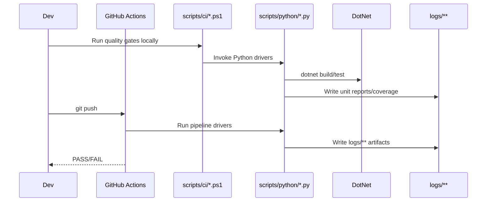

> 目标：定义 Windows-only（Godot 4.5 + C#）的“可执行门禁”清单，以及本地/CI 的运行方式。所有门禁必须落盘 `logs/**` 作为取证。

## 0.1 开发构建视图（C4 Container）

```mermaid
C4Container
    title Development & Build Toolchain (Godot+C#)
    Person(dev, "Developer", "Edits code, runs local gates, pushes to CI")

    System_Boundary(devenv, "Development Environment (Windows)") {
        Container(ide, "IDE", "VS/Rider/VS Code", "Edit / debug")
        Container(dotnet, ".NET SDK", "dotnet 8", "Build / test / coverage")
        Container(godot, "Godot Editor", "Godot 4.5 (.NET/mono)", "Run / debug / export")
        Container(ps, "PowerShell", "pwsh", "Run CI scripts")
        Container(py, "Python", "py -3", "Run gate drivers and validators")
    }

    System_Boundary(cicd, "CI/CD (GitHub Actions)") {
        Container(ci_runner, "Runner", "windows-latest", "Runs quality gates and smoke tests")
    }

    Rel(dev, ide, "edit")
    Rel(dev, ps, "run scripts")
    Rel(ps, py, "invoke")
    Rel(py, dotnet, "build/test")
    Rel(ps, godot, "headless smoke/export")
    Rel(dev, ci_runner, "git push")
```

## 0.2 CI 运行序列（示意）



## A) 最小门禁集（Windows-only，SSoT）

> Base（01/02/03/07/09/10/11/12）定义跨切面口径；功能纵切在 `overlays/08`。

| Gate | Script/Command | Purpose | Evidence (logs/**) |
| --- | --- | --- | --- |
| Base-Clean | `scripts/ci/verify_base_clean.ps1` | 防止 Base 出现 PRD_ID/具体 08 内容；Overlay 08 必须回链 CH01/CH03 | `logs/ci/<run>/base-clean/summary.json` |
| 旧栈术语（严格） | `py -3 scripts/python/scan_doc_stack_terms.py --root docs/architecture/base --fail-on-hits` | 防止旧技术栈词汇回流到 Base | `logs/ci/<date>/doc-stack-scan/strict/**` |
| 旧栈术语（取证） | `py -3 scripts/python/scan_doc_stack_terms.py --root docs --out logs/ci/<date>/doc-stack-scan/full` | 全量 docs 趋势取证（不阻断） | `logs/ci/<date>/doc-stack-scan/full/**` |
| Task links | `py -3 scripts/python/task_links_validate.py` | 校验 ADR/CH/Overlay 回链与 Front-Matter | `logs/ci/<date>/task-links.json` |
| Task triplet | `py -3 scripts/python/verify_task_mapping.py` | 校验 tasks.json 与 views 的映射与元数据 | `logs/ci/<date>/task-mapping/**` |
| Typecheck | `dotnet build -warnaserror` | C# 编译与分析器门禁 | `logs/ci/<date>/typecheck.log` |
| Unit tests | `dotnet test` | xUnit 单元测试（Core 不依赖引擎） | `logs/unit/<date>/**` |
| Engine smoke | `scripts/ci/run_gdunit_tests.ps1` | Godot headless + GdUnit4 冒烟/安全 | `logs/e2e/<date>/**` |
| Security scan | `py -3 scripts/python/security_soft_scan.py`（如存在） | 静态扫描不安全 API/HTTP/越权路径 | `logs/ci/<date>/security-*.jsonl` |
| Perf smoke | `scripts/ci/check_perf_budget.ps1` | PERF marker 解析与门禁 | `logs/perf/<date>/summary.json` |

备注：
- “旧栈术语（严格）”建议只对 Base/入口/当前 Overlay 08 做硬门禁；全量 docs 扫描只做取证（止损策略）。
- CI 中 `scripts/python/ci_pipeline.py` 已封装“严格 + 取证”两类扫描并落盘到 `logs/ci/<date>/doc-stack-scan/**`。

## B) 本地运行

### 一键门禁（需要设置 `GODOT_BIN`）

```powershell
powershell -NoProfile -ExecutionPolicy Bypass -File scripts/ci/quality_gate.ps1 -GodotBin $env:GODOT_BIN
```

### 带导出/EXE 冒烟（可选）

```powershell
powershell -NoProfile -ExecutionPolicy Bypass -File scripts/ci/quality_gate.ps1 -GodotBin $env:GODOT_BIN -WithExport
```

## C) 日志与 SSoT

- 所有门禁/扫描/测试输出落 `logs/**`，用于排障与归档；不要把 `logs/**` 提交到仓库。
- 入口索引以 `docs/PROJECT_DOCUMENTATION_INDEX.md` 为准；不要在多个文档复制阈值/策略文本。
