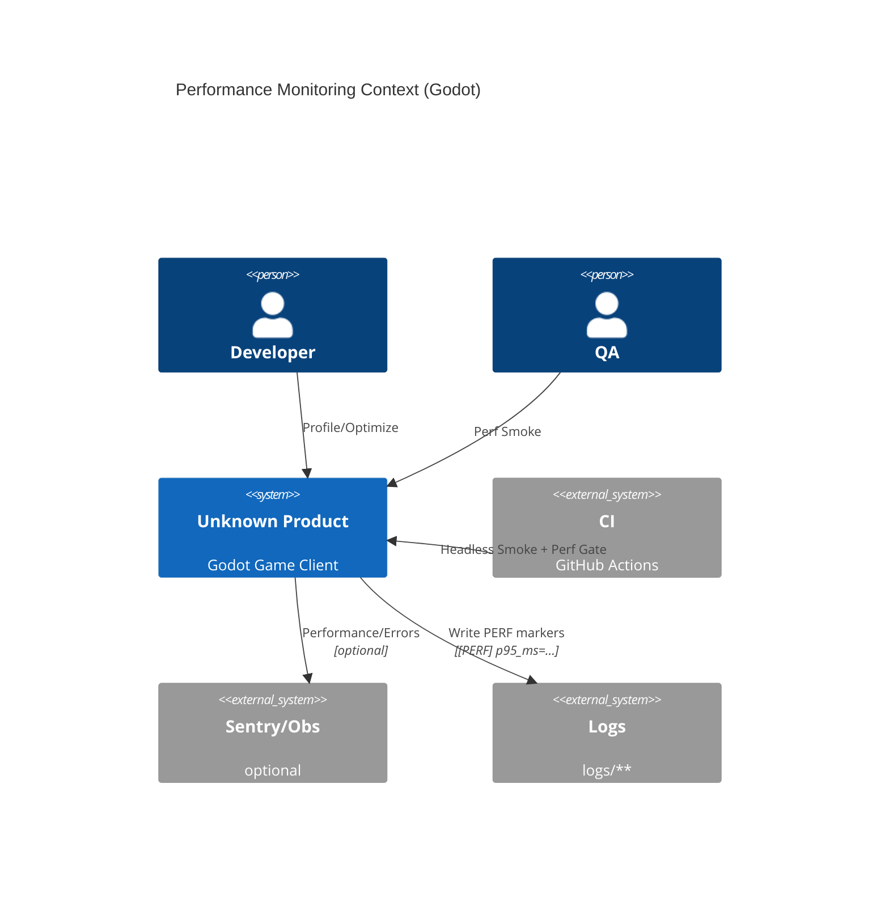

> 目标：定义 Godot+C#（Windows-only）的性能预算与容量规划口径（SSoT），并给出可执行的 perf smoke 与门禁方式（输出落 `logs/**`）。

## 0.1 性能监控上下文（C4 Context）



## 1. 性能预算（Performance Budgets，SSoT：ADR-0015）

> 阈值与门禁口径只在 ADR-0015/CH09 维护；Overlay 08 只能引用，不复制具体阈值。

推荐最小指标（示例）：

| 指标 | 采集方式 | 典型来源 | 用途 |
| --- | --- | --- | --- |
| `p95_ms`（逻辑帧耗时） | Headless 输出 marker | `[PERF] p95_ms=...` | 帧耗时预算门禁 |
| `startup_ms`（启动耗时） | Headless 输出 marker | `[PERF] startup_ms=...` | 启动预算门禁 |
| `working_set_mb`（内存） | CI/脚本采样 | 进程/诊断输出 | 容量趋势 |

## 2. 执行路径（Smoke + Gate）

### 2.1 Headless smoke 产出 PERF marker

- Headless 冒烟：`scripts/ci/smoke_headless.ps1`
- 示例输出（仅示例格式）：

```
[PERF] p95_ms=14.2 samples=120 scene=res://Game.Godot/Scenes/Main.tscn
```

> 说明：marker 仅负责“可机器解析”；深入剖析建议用 Godot Profiler 或外部 profiler（按团队约定）。

### 2.2 Perf Budget Gate（PowerShell）

- 解析脚本：`scripts/ci/check_perf_budget.ps1`
- 输入：headless log；输出：`logs/perf/<date>/summary.json`

```powershell
powershell -NoProfile -ExecutionPolicy Bypass -File scripts/ci/smoke_headless.ps1 -GodotBin $env:GODOT_BIN
powershell -NoProfile -ExecutionPolicy Bypass -File scripts/ci/check_perf_budget.ps1 -MaxP95Ms 16
```

### 2.3 作为质量门禁的一部分运行

`quality_gate.ps1` 可组合运行 perf gate（参数以脚本实际实现为准）：

```powershell
powershell -NoProfile -ExecutionPolicy Bypass -File scripts/ci/quality_gate.ps1 -GodotBin $env:GODOT_BIN -PerfP95Ms 16
```

## 3. 容量规划（Capacity，Base 口径）

- 对每个 ${FEATURE_*} 记录“CPU/内存/存储”主要消耗项与增长因素。
- 数据与存档：SQLite/文件均位于 `user://`；需要考虑迁移、备份与失败路径（CH05/CH06）。
- 高负载点（例如大量实体/大量 UI 元素/大地图）优先做分帧/批处理与异步 IO。

## 4. 性能债（Perf Debt）

- 任何临时放宽门禁/指标波动必须落 Issue，并在 PR 描述写清 owner 与回迁计划。
- 取证优先：把当时的 `logs/perf/**` 与关键场景信息附在 Issue 里。

## 5. 与 CH03/CH07 的关系

- CH03：可观测性与日志归档（perf marker 也是可观测性的一部分）。
- CH07：门禁脚本与 CI 执行方式。
- CH09：预算口径本身（本页）。
