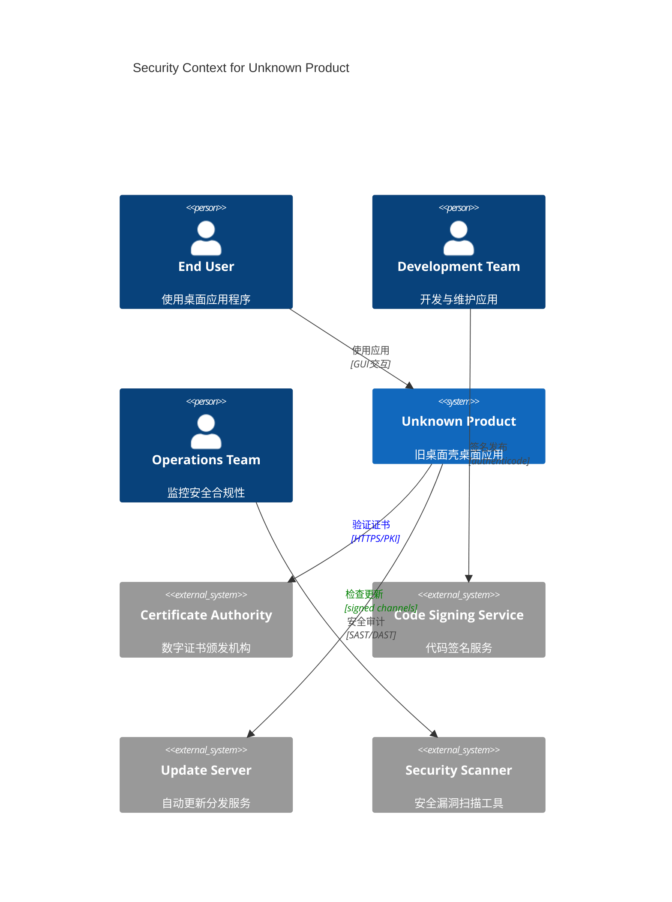
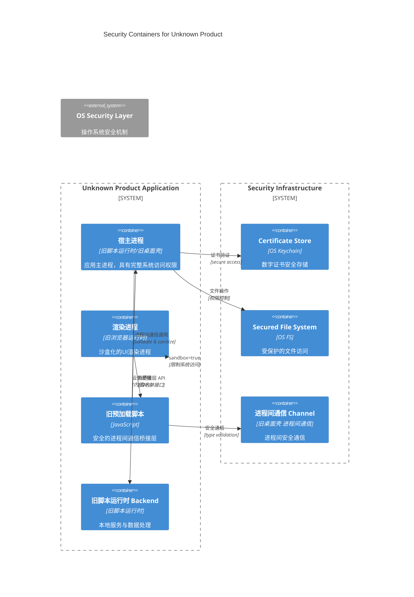
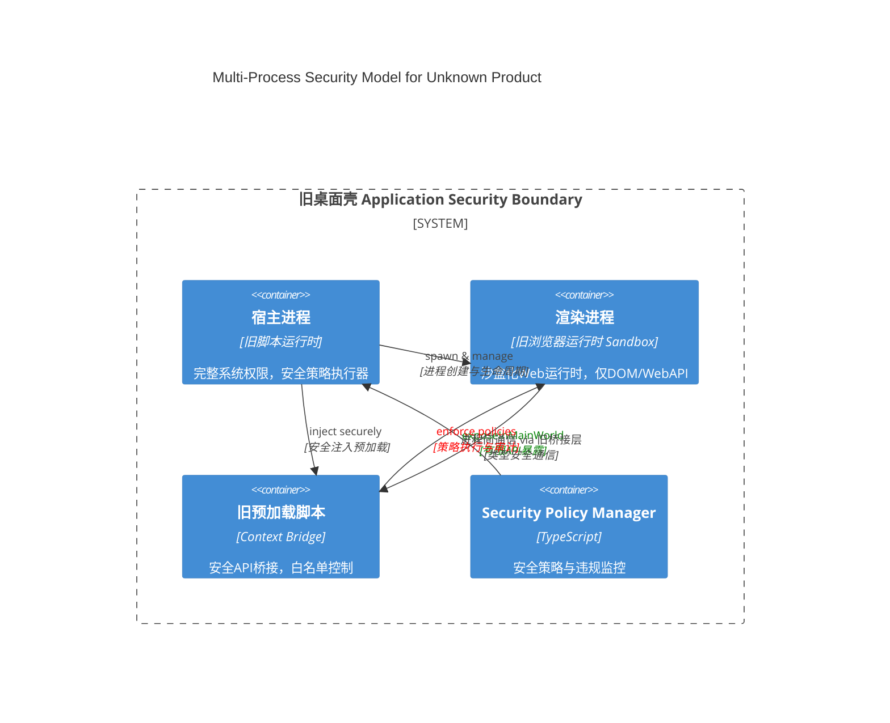

<!--
THIS IS THE V2 BASE VERSION - CLEAN TEMPLATE WITH PLACEHOLDERS.
All domain-specific terms replaced with ${DOMAIN_*} placeholders.
Stable anchors preserved for cross-references.
References: ADR-0002 (旧桌面壳 Security Baseline), ADR-0005 (Quality Gates)
-->

# 02 安全基线（旧桌面壳）v2 - 深度防御体系

> **目的**: 建立 旧桌面壳 应用的全面安全基线，覆盖进程隔离、进程间通信 安全、供应链防护等关键维度，确保 Unknown Product 在桌面环境下的安全运行。

> **v2 改进**: 对齐最新 旧桌面壳 安全最佳实践，强化自动化验证机制，整合 Web 内容安全策略 2.0 规范，建立完整的安全追踪体系。

---

## 0.1 安全上下文视图（C4 Context）



## 0.2 安全容器架构（C4 Container）



---

## 2.1 目标与范围（Security Objectives & Scope）

<!-- sec:2.1 -->

### 安全目标层次化

**Tier-0 关键安全目标（零容忍）**:

- **进程隔离完整性**: 主进程/渲染进程/预加载脚本严格权限分离
- **代码执行控制**: 杜绝任意代码执行（RCE）攻击向量
- **数据访问边界**: 沙箱环境下最小权限原则

**Tier-1 重要安全目标**:

- **网络通信安全**: HTTPS 强制、Web 内容安全策略 合规、安全标头完整
- **本地存储保护**: 敏感数据加密、临时文件清理
- **更新机制安全**: 签名验证、完整性校验

### 威胁建模（STRIDE 分析）

| 威胁类型                   | 具体风险             | 缓解策略           | 验证方法        |
| -------------------------- | -------------------- | ------------------ | --------------- |
| **Spoofing**               | 恶意网站冒充应用内容 | 严格Web 内容安全策略 + 同源策略 | E2E Web 内容安全策略违规检测 |
| **Tampering**              | 注入恶意脚本/资源    | 内容完整性校验     | 资源哈希验证    |
| **Repudiation**            | 安全事件不可追踪     | 结构化安全日志     | 审计日志完整性  |
| **Information Disclosure** | 敏感信息泄露         | 内存清零、安全存储 | 内存扫描测试    |
| **Denial of Service**      | 资源耗尽攻击         | 资源限制、率限     | 压力测试验证    |
| **Elevation of Privilege** | 权限提升攻击         | 最小权限+沙箱      | 权限边界测试    |

### 安全边界定义

```typescript
// 安全域划分
interface SecurityDomain {
  readonly name: 'main' | 'renderer' | 'preload' | 'webworker';
  readonly trustLevel: 'trusted' | 'sandboxed' | 'isolated';
  readonly allowedOperations: readonly string[];
  readonly communicationChannels: readonly string[];
}

const SECURITY_DOMAINS: readonly SecurityDomain[] = [
  {
    name: 'main',
    trustLevel: 'trusted',
    allowedOperations: ['fs', 'net', 'os', 'crypto'],
    communicationChannels: ['进程间通信-main'],
  },
  {
    name: 'renderer',
    trustLevel: 'sandboxed',
    allowedOperations: ['dom', 'webapi'],
    communicationChannels: ['进程间通信-renderer', 'context-bridge'],
  },
  {
    name: 'preload',
    trustLevel: 'isolated',
    allowedOperations: ['context-bridge-whitelist'],
    communicationChannels: ['context-bridge'],
  },
] as const;
```

### 合规性要求

- **OWASP Top 10**: 针对 Web/Desktop 应用的安全风险防护
- **CWE 覆盖**: 重点关注 CWE-94（代码注入）、CWE-79（XSS）、CWE-200（信息泄露）
- **内部安全基线**: 遵循 ADR-0002 定义的安全约束

---

## 2.2 进程与隔离架构（Process Isolation Architecture）

<!-- sec:2.2 -->

### 多进程安全模型



### 进程权限矩阵

| 进程类型       | 旧脚本运行时 API         | 文件系统    | 网络访问    | 系统调用    | 进程间通信通信        |
| -------------- | ------------------- | ----------- | ----------- | ----------- | -------------- |
| **主进程**     |  完全访问         |  完全访问 |  完全访问 |  完全访问 |  服务端      |
| **渲染进程**   |  禁止             |  禁止     |  仅HTTPS  |  禁止     |  客户端      |
| **预加载脚本** |  仅Context Bridge |  禁止     |  禁止     |  禁止     |  桥接        |
| **Web Worker** |  禁止             |  禁止     |  仅HTTPS  |  禁止     |  PostMessage |

### 关键配置强制要求

```typescript
// src/main/security/window-config.ts
export const MANDATORY_SECURITY_CONFIG = {
  webPreferences: {
    // === 核心安全三要素（不可更改） ===
    旧脚本集成开关: false, // 硬约束：禁用旧脚本运行时集成
    旧隔离开关: true, // 硬约束：启用上下文隔离
    sandbox: true, // 硬约束：启用沙箱模式

    // === 辅助安全措施 ===
    webSecurity: true, // 启用Web安全
    allowRunningInsecureContent: false, // 禁用混合内容
    experimentalFeatures: false, // 禁用实验性功能
    enableBlinkFeatures: undefined, // 禁用Blink特性

    // === 预加载脚本白名单 ===
    preload: path.join(__dirname, '../preload/security-bridge.js'),
    additionalArguments: ['--disable-web-security=false'],
  },
} as const;

// 编译时配置验证
type SecurityConfigValidator<T> = T extends {
  webPreferences: {
    旧脚本集成开关: false;
    旧隔离开关: true;
    sandbox: true;
  };
}
  ? T
  : never;

// 确保配置类型安全
export type ValidSecurityConfig = SecurityConfigValidator<
  typeof MANDATORY_SECURITY_CONFIG
>;
```

### 进程间通信安全策略

```typescript
// src/shared/contracts/进程间通信-security.ts
export interface SecureIpcChannel {
  readonly channel: `${string}:${string}`; // 强制命名空间格式
  readonly direction: 'main-to-renderer' | 'renderer-to-main' | 'bidirectional';
  readonly authentication: 'none' | 'session' | 'signature';
  readonly rateLimit: {
    readonly maxRequests: number;
    readonly windowMs: number;
  };
}

// 白名单进程间通信通道定义
export const ALLOWED_IPC_CHANNELS: readonly SecureIpcChannel[] = [
  {
    channel: 'app:getVersion',
    direction: 'renderer-to-main',
    authentication: 'none',
    rateLimit: { maxRequests: 10, windowMs: 60000 },
  },
  {
    channel: 'game:save',
    direction: 'bidirectional',
    authentication: 'session',
    rateLimit: { maxRequests: 5, windowMs: 30000 },
  },
  {
    channel: 'telemetry:track',
    direction: 'renderer-to-main',
    authentication: 'none',
    rateLimit: { maxRequests: 100, windowMs: 60000 },
  },
] as const;
```

---

## 2.3 旧窗口容器 安全配置清单（Security Configuration Checklist）

<!-- sec:2.3 -->

### 安全窗口配置核心

```typescript
// src/main/security/secure-window.ts
export function createSecureWindow(options: SecureWindowOptions): 旧窗口容器 {
  const window = new 旧窗口容器({
    title: options.title,
    ...MANDATORY_SECURITY_CONFIG, // 继承核心安全配置
    show: false, // 延迟显示确保安全检查
    webPreferences: {
      ...MANDATORY_SECURITY_CONFIG.webPreferences,
      partition: 'persist:secure-session',
      devTools: process.env.NODE_ENV === 'development'
    }
  });

  setupSecurityEventHandlers(window);
  return window;
}

function setupSecurityEventHandlers(window: 旧窗口容器): void {
  const webContents = window.webContents;

  // 增强窗口导航安全：协调will-navigate和setWindowOpenHandler
  setupEnhancedNavigationSecurity(webContents);
}

// 增强导航安全协调机制
function setupEnhancedNavigationSecurity(webContents: WebContents): void {
  const allowedOrigins = process.env.NODE_ENV === 'production'
    ? ['file://', 'app://']
    : ['file://', 'http://localhost:5173', 'http://127.0.0.1:5173'];

  const navigationEventLog: Array<{
    type: 'navigate' | 'window-open';
    url: string;
    allowed: boolean;
    timestamp: number;
    userInitiated: boolean;
  }> = [];

  // Step 1: will-navigate事件处理（页面导航拦截）
  webContents.on('will-navigate', (event, navigationUrl, isInPlace, isMainFrame, frameProcessId, frameRoutingId) => {
    const navigationDecision = evaluateNavigationSecurity({
      url: navigationUrl,
      isInPlace,
      isMainFrame,
      webContents,
      type: 'navigate'
    });

    // 记录导航事件
    navigationEventLog.push({
      type: 'navigate',
      url: navigationUrl,
      allowed: navigationDecision.allowed,
      timestamp: Date.now(),
      userInitiated: navigationDecision.userInitiated
    });

    if (!navigationDecision.allowed) {
      console.warn(` 导航被阻止: ${navigationUrl} (原因: ${navigationDecision.reason})`);
      event.preventDefault();

      // 发送安全事件到渲染进程
      webContents.send('security:navigation-blocked', {
        url: navigationUrl,
        reason: navigationDecision.reason,
        timestamp: Date.now(),
        alternatives: navigationDecision.alternatives
      });
    }
  });

  // Step 2: setWindowOpenHandler（新窗口创建拦截）
  webContents.setWindowOpenHandler((details) => {
    const { url, frameName, features, disposition, referrer, postBody } = details;

    const windowOpenDecision = evaluateWindowOpenSecurity({
      url,
      frameName,
      features,
      disposition,
      referrer: referrer?.url,
      webContents
    });

    // 记录窗口打开事件
    navigationEventLog.push({
      type: 'window-open',
      url: url || 'about:blank',
      allowed: windowOpenDecision.action !== 'deny',
      timestamp: Date.now(),
      userInitiated: windowOpenDecision.userInitiated
    });

    if (windowOpenDecision.action === 'deny') {
      console.warn(` 新窗口创建被阻止: ${url} (原因: ${windowOpenDecision.reason})`);

      // 通知渲染进程窗口创建被阻止
      webContents.send('security:window-open-blocked', {
        url: url || 'about:blank',
        reason: windowOpenDecision.reason,
        timestamp: Date.now(),
        suggestion: windowOpenDecision.suggestion
      });
    }

    return {
      action: windowOpenDecision.action,
      ...(windowOpenDecision.overrideBrowserWindowOptions && {
        overrideBrowserWindowOptions: windowOpenDecision.overrideBrowserWindowOptions
      })
    };
  });

  // Step 3: 协调安全监控
  webContents.on('did-fail-load', (event, errorCode, errorDescription, validatedURL, isMainFrame) => {
    if (isMainFrame && errorCode === -3) { // ERR_ABORTED，可能是安全拦截导致
      console.log(` 主框架加载中止，可能被安全策略拦截: ${validatedURL}`);
    }
  });

  // 定期清理导航事件日志（保留最近100条）
  setInterval(() => {
    if (navigationEventLog.length > 100) {
      navigationEventLog.splice(0, navigationEventLog.length - 100);
    }
  }, 300000); // 每5分钟清理一次
}

// 导航安全评估函数
function evaluateNavigationSecurity(context: {
  url: string;
  isInPlace?: boolean;
  isMainFrame?: boolean;
  webContents: WebContents;
  type: 'navigate' | 'window-open';
}): {
  allowed: boolean;
  reason?: string;
  userInitiated: boolean;
  alternatives?: string[];
} {
  const { url, isMainFrame, webContents } = context;

  // 允许的导航来源
  const allowedOrigins = process.env.NODE_ENV === 'production'
    ? ['file://', 'app://']
    : ['file://', 'http://localhost:5173', 'http://127.0.0.1:5173'];

  // 检查URL是否在允许列表中
  const isAllowedOrigin = allowedOrigins.some(origin => url.startsWith(origin));

  if (!isAllowedOrigin) {
    // 特殊情况：内部相对路径导航
    if (url.startsWith('/') || url.startsWith('./') || url.startsWith('../')) {
      return {
        allowed: true,
        userInitiated: true
      };
    }

    // 特殊情况：fragment导航（#hash）
    if (url.includes('#') && url.split('#')[0] === webContents.getURL().split('#')[0]) {
      return {
        allowed: true,
        userInitiated: true
      };
    }

    // 特殊情况：query参数导航
    if (url.includes('?') && url.split('?')[0] === webContents.getURL().split('?')[0]) {
      return {
        allowed: true,
        userInitiated: true
      };
    }

    // 外部链接：提供安全的替代方案
    const alternatives = isMainFrame
      ? ['在系统默认浏览器中打开', '复制链接地址', '显示链接预览']
      : ['在新标签页中查看'];

    return {
      allowed: false,
      reason: `外部链接不被允许: ${url}`,
      userInitiated: true, // 假设是用户触发
      alternatives
    };
  }

  return {
    allowed: true,
    userInitiated: true
  };
}

// 窗口打开安全评估函数
function evaluateWindowOpenSecurity(context: {
  url?: string;
  frameName?: string;
  features?: string;
  disposition?: string;
  referrer?: string;
  webContents: WebContents;
}): {
  action: 'allow' | 'deny';
  reason?: string;
  userInitiated: boolean;
  suggestion?: string;
  overrideBrowserWindowOptions?: any;
} {
  const { url, frameName, features, disposition } = context;

  // 空白页面或未指定URL：默认拒绝
  if (!url || url === 'about:blank') {
    return {
      action: 'deny',
      reason: '不允许创建空白窗口',
      userInitiated: true,
      suggestion: '请指定有效的目标URL'
    };
  }

  // 检查是否为允许的内部URL
  const allowedOrigins = process.env.NODE_ENV === 'production'
    ? ['file://', 'app://']
    : ['file://', 'http://localhost:5173', 'http://127.0.0.1:5173'];

  const isInternalUrl = allowedOrigins.some(origin => url.startsWith(origin));

  if (!isInternalUrl) {
    // 外部URL：建议在系统浏览器中打开
    return {
      action: 'deny',
      reason: '外部URL应在系统浏览器中打开',
      userInitiated: true,
      suggestion: `建议使用shell.openExternal('${url}')在系统浏览器中打开`
    };
  }

  // 内部URL：允许但应用安全配置
  const secureWindowOptions = {
    旧脚本集成开关: false,
    旧隔离开关: true,
    sandbox: true,
    webSecurity: true,
    allowRunningInsecureContent: false,
    experimentalFeatures: false,
    title: `${frameName || 'Guild Manager'} - 子窗口`
  };

  return {
    action: 'allow',
    userInitiated: true,
    overrideBrowserWindowOptions: secureWindowOptions
  };
}

  // 权限管理：增强双重处理机制
  const ses = webContents.session;
  setupDualPermissionHandlers(ses, webContents);
}

// 双重权限处理策略：静态检查 + 动态请求
function setupDualPermissionHandlers(session: Session, webContents: WebContents): void {
  // Step 1: setPermissionCheckHandler - 静态权限检查（已有权限验证）
  session.setPermissionCheckHandler((webContents, permission, requestingOrigin) => {
    const allowedOrigins = process.env.NODE_ENV === 'production'
      ? ['file://', 'app://']
      : ['file://', 'http://localhost:5173', 'http://127.0.0.1:5173'];

    // 基于来源的静态权限矩阵
    const staticPermissions: Record<string, string[]> = {
      'file://': ['clipboard-read', 'clipboard-write', 'fullscreen'],
      'app://': ['clipboard-read', 'clipboard-write', 'fullscreen'],
      'http://localhost:5173': ['fullscreen'], // 开发环境
      'http://127.0.0.1:5173': ['fullscreen']  // 开发环境
    };

    const origin = requestingOrigin || webContents.getURL();
    const matchedOrigin = allowedOrigins.find(allowed => origin.startsWith(allowed));

    if (!matchedOrigin) {
      console.warn(` 权限检查拒绝：未授权来源 ${origin} 请求权限 ${permission}`);
      return false;
    }

    const allowed = staticPermissions[matchedOrigin]?.includes(permission) || false;
    if (!allowed) {
      console.warn(` 权限检查拒绝：来源 ${matchedOrigin} 无权限 ${permission}`);
    }
    return allowed;
  });

  // Step 2: setPermissionRequestHandler - 动态权限请求处理
  session.setPermissionRequestHandler(async (webContents, permission, callback, details) => {
    const origin = webContents.getURL();
    const userAgent = webContents.getUserAgent();

    // 高风险权限必须显式确认
    const highRiskPermissions = [
      'camera', 'microphone', 'geolocation', 'notifications',
      'persistent-storage', 'midi', 'background-sync'
    ];

    // 中风险权限自动决策
    const mediumRiskPermissions = [
      'clipboard-read', 'clipboard-write', 'fullscreen', 'display-capture'
    ];

    if (highRiskPermissions.includes(permission)) {
      // 高风险权限：记录并拒绝（未来可增加用户确认对话框）
      console.error(` 高风险权限请求被拒绝: ${permission} from ${origin}`);

      // 发送安全事件到监控系统
      webContents.send('security:permission-denied', {
        permission,
        origin,
        reason: 'high-risk-policy',
        timestamp: Date.now()
      });

      callback(false);
      return;
    }

    if (mediumRiskPermissions.includes(permission)) {
      // 中风险权限：基于上下文智能决策
      const shouldAllow = await evaluatePermissionContext({
        permission,
        origin,
        userAgent,
        details,
        webContents
      });

      console.log(` 中风险权限决策: ${permission} -> ${shouldAllow ? '允许' : '拒绝'}`);
      callback(shouldAllow);
      return;
    }

    // 默认拒绝未知权限
    console.warn(` 未知权限请求被拒绝: ${permission} from ${origin}`);
    callback(false);
  });
}

// 权限上下文评估函数
async function evaluatePermissionContext(context: {
  permission: string;
  origin: string;
  userAgent: string;
  details: any;
  webContents: WebContents;
}): Promise<boolean> {
  const { permission, origin, webContents } = context;

  // 评估因子
  const factors = {
    isMainWindow: webContents.id === 1, // 假设主窗口ID为1
    isSecureOrigin: origin.startsWith('https://') || origin.startsWith('file://'),
    hasUserGesture: true, // 可通过details获取
    sessionAge: Date.now() - (webContents as any)._startTime || 0,
  };

  // 基于评估因子的决策逻辑
  switch (permission) {
    case 'clipboard-read':
    case 'clipboard-write':
      return factors.isMainWindow && factors.hasUserGesture;

    case 'fullscreen':
      return factors.isMainWindow && factors.isSecureOrigin;

    case 'display-capture':
      // 仅在主窗口且会话时间>5分钟时允许
      return factors.isMainWindow && factors.sessionAge > 300000;

    default:
      return false;
  }
}
```

### 安全配置验证清单

#### 自动化验证脚本

```javascript
// scripts/verify-security-config.mjs
import fs from 'node:fs';
import path from 'node:path';

const SECURITY_REQUIREMENTS = {
  mandatory: {
    旧脚本集成开关: false,
    旧隔离开关: true,
    sandbox: true,
    webSecurity: true,
    allowRunningInsecureContent: false,
  },
  forbidden: {
    experimentalFeatures: true,
    enableBlinkFeatures: undefined,
    nodeIntegrationInSubFrames: true,
  },
};

export function verifySecurityConfig(configPath) {
  const config = JSON.parse(fs.readFileSync(configPath, 'utf-8'));
  const violations = [];

  // 检查必需配置
  for (const [key, expectedValue] of Object.entries(
    SECURITY_REQUIREMENTS.mandatory
  )) {
    const actualValue = config.webPreferences?.[key];
    if (actualValue !== expectedValue) {
      violations.push(`${key}: expected ${expectedValue}, got ${actualValue}`);
    }
  }

  // 检查禁止配置
  for (const [key, forbiddenValue] of Object.entries(
    SECURITY_REQUIREMENTS.forbidden
  )) {
    const actualValue = config.webPreferences?.[key];
    if (actualValue === forbiddenValue) {
      violations.push(`${key}: forbidden value ${forbiddenValue} detected`);
    }
  }

  return violations;
}

// CLI 执行
if (process.argv[2]) {
  const violations = verifySecurityConfig(process.argv[2]);
  if (violations.length > 0) {
    console.error(' Security violations detected:');
    violations.forEach(v => console.error(`  - ${v}`));
    process.exit(1);
  } else {
    console.log(' Security configuration verified');
  }
}
```

#### 运行时配置审计

```typescript
// src/main/security/config-auditor.ts
export interface SecurityAuditResult {
  readonly passed: boolean;
  readonly violations: readonly string[];
  readonly warnings: readonly string[];
  readonly timestamp: number;
}

export class SecurityConfigAuditor {
  private static readonly CRITICAL_CONFIGS = [
    '旧脚本集成开关',
    '旧隔离开关',
    'sandbox',
  ] as const;

  public static auditBrowserWindow(window: 旧窗口容器): SecurityAuditResult {
    const webPrefs = window.webContents.getWebPreferences();
    const violations: string[] = [];
    const warnings: string[] = [];

    // 审计关键安全配置
    if (webPrefs.旧脚本集成开关 !== false) {
      violations.push('旧脚本集成开关 must be false');
    }

    if (webPrefs.旧隔离开关 !== true) {
      violations.push('旧隔离开关 must be true');
    }

    if (webPrefs.sandbox !== true) {
      violations.push('sandbox must be true');
    }

    if (webPrefs.webSecurity === false) {
      warnings.push(
        'webSecurity is disabled - should only be used in development'
      );
    }

    // 检查预加载脚本路径
    if (webPrefs.preload && !path.isAbsolute(webPrefs.preload)) {
      violations.push('旧预加载脚本 path must be absolute');
    }

    return {
      passed: violations.length === 0,
      violations,
      warnings,
      timestamp: Date.now(),
    };
  }
}
```

---

## 2.4 严格 Web 内容安全策略（Content Security Policy）

<!-- sec:2.4 -->

### Web 内容安全策略增强策略v2（Nonce/Hash机制，移除unsafe-inline）

```typescript
// src/main/security/Web 内容安全策略-manager-v2.ts
import crypto from 'crypto';
import { Session } from '旧桌面壳';

export class CspManagerV2 {
  private static instance: CspManagerV2;
  private readonly nonceStore = new Map<
    string,
    { nonce: string; timestamp: number }
  >();
  private readonly scriptHashes = new Set<string>();
  private readonly styleHashes = new Set<string>();

  static getInstance(): CspManagerV2 {
    if (!CspManagerV2.instance) {
      CspManagerV2.instance = new CspManagerV2();
    }
    return CspManagerV2.instance;
  }

  // 生成并缓存nonce（每个页面请求一个新nonce）
  generateNonce(requestId: string): string {
    const nonce = crypto.randomBytes(16).toString('base64');
    this.nonceStore.set(requestId, { nonce, timestamp: Date.now() });

    // 清理过期nonce（5分钟）
    setTimeout(() => this.nonceStore.delete(requestId), 300000);
    return nonce;
  }

  // 注册脚本内容hash（构建时预计算）
  registerScriptHash(content: string): string {
    const hash = crypto.createHash('sha384').update(content).digest('base64');
    this.scriptHashes.add(`'sha384-${hash}'`);
    return hash;
  }

  // 注册样式内容hash（构建时预计算）
  registerStyleHash(content: string): string {
    const hash = crypto.createHash('sha384').update(content).digest('base64');
    this.styleHashes.add(`'sha384-${hash}'`);
    return hash;
  }

  getCSPHeader(env: 'development' | 'production', requestId?: string): string {
    const commonCsp = [
      "default-src 'self'",
      "object-src 'none'",
      "frame-ancestors 'none'",
      "base-uri 'self'",
      "form-action 'self'",
      'upgrade-insecure-requests',
    ];

    if (env === 'development') {
      // 开发环境：激活nonce机制，移除unsafe-inline和unsafe-eval
      const nonce = this.generateNonce(requestId); // 激活已实现的nonce功能
      return [
        ...commonCsp,
        "script-src 'self' 'nonce-${RUNTIME_NONCE}' localhost:* 127.0.0.1:*", // 移除unsafe-eval，添加nonce支持
        `style-src 'self' 'nonce-${RUNTIME_NONCE}' localhost:* 127.0.0.1:*`, // 移除unsafe-inline
        "connect-src 'self' https://api.${PRODUCT_DOMAIN} wss://api.${PRODUCT_DOMAIN} https://${DOMAIN_OBSERVABILITY} https://*.ingest.${DOMAIN_OBSERVABILITY} ws://localhost:* wss://localhost:* ws://127.0.0.1:* wss://127.0.0.1:*",
        "img-src 'self' data: blob: localhost:* 127.0.0.1:*",
      ].join('; ');
    }

    // 生产环境：严格策略，零unsafe-inline
    const scriptSources = ["'self'"];
    const styleSources = ["'self'"];

    // 添加预计算的script hashes
    if (this.scriptHashes.size > 0) {
      scriptSources.push(...Array.from(this.scriptHashes));
    }

    // 添加预计算的style hashes（Tailwind Critical CSS）
    if (this.styleHashes.size > 0) {
      styleSources.push(...Array.from(this.styleHashes));
    }

    // 如果使用nonce机制（SSR场景）
    if (requestId && this.nonceStore.has(requestId)) {
      const { nonce } = this.nonceStore.get(requestId)!;
      scriptSources.push(`'nonce-${nonce}'`);
      styleSources.push(`'nonce-${nonce}'`);
    }

    const productionCsp = [
      ...commonCsp,
      `script-src ${scriptSources.join(' ')}`,
      `style-src ${styleSources.join(' ')}`, // 移除 unsafe-inline
      "connect-src 'self' https://api.${PRODUCT_DOMAIN} wss://api.${PRODUCT_DOMAIN} https://${DOMAIN_OBSERVABILITY} https://*.ingest.${DOMAIN_OBSERVABILITY}", // 与ADR-0002保持一致
      "img-src 'self' data: https: blob:",
      "font-src 'self'",
    ].join('; ');

    return productionCsp;
  }
}

// 完整生产Web 内容安全策略配置示例（与ADR-0002保持一致）
const productionCSPExample = `
  default-src 'self';
  script-src 'self' 'nonce-\${RUNTIME_NONCE}';
  style-src 'self' 'nonce-\${RUNTIME_NONCE}';
  img-src 'self' data: https: blob:;
  font-src 'self' data:;
  connect-src 'self' https://api.\${PRODUCT_DOMAIN} wss://api.\${PRODUCT_DOMAIN} https://${DOMAIN_OBSERVABILITY} https://*.ingest.${DOMAIN_OBSERVABILITY};
  object-src 'none';
  frame-ancestors 'none';
  base-uri 'self';
  form-action 'self';
  upgrade-insecure-requests;
`
  .replace(/\s+/g, ' ')
  .trim();

// 在主进程中注册增强Web 内容安全策略拦截器
export function installCspHeaderV2(ses: Session, env = process.env.NODE_ENV) {
  const cspManager = CspManagerV2.getInstance();

  ses.webRequest.onHeadersReceived((details, callback) => {
    const environment = env === 'production' ? 'production' : 'development';
    const requestId = details.url; // 使用URL作为requestId

    callback({
      responseHeaders: {
        ...details.responseHeaders,
        'Web 内容安全策略': [
          cspManager.getCSPHeader(environment, requestId),
        ],
        // 基础安全标头
        'X-Content-Type-Options': ['nosniff'],
        'X-Frame-Options': ['DENY'],
        'Referrer-Policy': ['strict-origin-when-cross-origin'],
        //  现代跨源隔离安全头（防御Spectre攻击）
        'Cross-Origin-Opener-Policy': ['same-origin'],
        'Cross-Origin-Embedder-Policy': ['require-corp'],
        'Cross-Origin-Resource-Policy': ['cross-origin'],
        'Permissions-Policy': [
          'camera=(), microphone=(), geolocation=(), payment=(), usb=()',
        ],
      },
    });
  });
}
```

```html
<!-- public/index.html - 开发环境兜底（使用nonce机制，符合ADR-0002安全基线）-->
<meta
  http-equiv="Web 内容安全策略"
  content="
  default-src 'self' localhost:*; object-src 'none'; frame-ancestors 'none';
  script-src 'self' 'nonce-${RUNTIME_NONCE}' localhost:*; 
  style-src 'self' 'nonce-${RUNTIME_NONCE}' localhost:*;
  connect-src 'self' https://api.${PRODUCT_DOMAIN} wss://api.${PRODUCT_DOMAIN} https://${DOMAIN_OBSERVABILITY} https://*.ingest.${DOMAIN_OBSERVABILITY} ws://localhost:* wss://localhost:*;
"
/>

<!-- 生产环境构建时替换为hash版本 -->
<!-- CSP_PRODUCTION_PLACEHOLDER: 构建工具将替换为含hash的生产Web 内容安全策略 -->
```

```typescript
// scripts/build-Web 内容安全策略-hash.mjs - 构建时Web 内容安全策略 hash生成器
import fs from 'node:fs';
import crypto from 'crypto';
import path from 'path';

export function generateCspHashes(distDir: string): {
  scripts: string[];
  styles: string[];
} {
  const scriptHashes = [];
  const styleHashes = [];

  // 扫描构建产物中的内联脚本和样式
  const indexHtml = fs.readFileSync(path.join(distDir, 'index.html'), 'utf8');

  // 提取内联脚本
  const scriptMatches = indexHtml.matchAll(
    /<script[^>]*>([\s\S]*?)<\/script>/g
  );
  for (const match of scriptMatches) {
    if (match[1].trim()) {
      const hash = crypto
        .createHash('sha384')
        .update(match[1])
        .digest('base64');
      scriptHashes.push(`'sha384-${hash}'`);
    }
  }

  // 提取内联样式
  const styleMatches = indexHtml.matchAll(/<style[^>]*>([\s\S]*?)<\/style>/g);
  for (const match of styleMatches) {
    if (match[1].trim()) {
      const hash = crypto
        .createHash('sha384')
        .update(match[1])
        .digest('base64');
      styleHashes.push(`'sha384-${hash}'`);
    }
  }

  return { scripts: scriptHashes, styles: styleHashes };
}

// 更新index.html的生产Web 内容安全策略
export function updateProductionCsp(distDir: string): void {
  const { scripts, styles } = generateCspHashes(distDir);

  const productionCsp = [
    "default-src 'self'",
    "object-src 'none'",
    "frame-ancestors 'none'",
    "base-uri 'self'",
    "form-action 'self'",
    `script-src 'self' ${scripts.join(' ')}`,
    `style-src 'self' ${styles.join(' ')}`,
    "connect-src 'self' wss://api.guildmanager.local",
    "img-src 'self' data: https: blob:",
    "font-src 'self'",
    'upgrade-insecure-requests',
  ].join('; ');

  const indexPath = path.join(distDir, 'index.html');
  let indexHtml = fs.readFileSync(indexPath, 'utf8');

  // 替换开发Web 内容安全策略为生产Web 内容安全策略
  indexHtml = indexHtml.replace(
    /<meta http-equiv="Web 内容安全策略"[^>]*>/,
    `<meta http-equiv="Web 内容安全策略" content="${productionCsp}">`
  );

  fs.writeFileSync(indexPath, indexHtml);
  console.log(
    ` Web 内容安全策略生产配置已更新，包含${scripts.length}个脚本hash和${styles.length}个样式hash`
  );
}
```

### Web 内容安全策略违规监控

```typescript
// src/main/security/Web 内容安全策略-reporter.ts
export class CspReporter {
  private violations: Array<{
    violatedDirective: string;
    blockedUri: string;
    timestamp: number;
  }> = [];

  reportViolation(report: {
    violatedDirective: string;
    blockedUri: string;
  }): void {
    this.violations.push({ ...report, timestamp: Date.now() });

    // 严重违规立即记录
    if (['script-src', 'object-src'].includes(report.violatedDirective)) {
      console.error(' Critical Web 内容安全策略 violation:', report);
    }
  }

  getViolationSummary(): Record<string, number> {
    return this.violations.reduce(
      (acc, v) => {
        const key = `${v.violatedDirective}:${v.blockedUri}`;
        acc[key] = (acc[key] || 0) + 1;
        return acc;
      },
      {} as Record<string, number>
    );
  }
}
```

---

## 2.5 进程间通信/旧桥接层 白名单策略（Secure Inter-Process Communication）

<!-- sec:2.5 -->

### Context Bridge 安全架构

```typescript
// src/preload/security-bridge.ts
import { 旧桥接层, ipcRenderer } from '旧桌面壳';

// 白名单通道定义
const ALLOWED_CHANNELS = [
  'app:getVersion',
  'app:getPlatform',
  'game:save',
  'game:load',
  'telemetry:track',
  'security:reportViolation',
] as const;

// 安全进程间通信包装器
class SecureIpcWrapper {
  private rateLimit = new Map<string, { count: number; resetTime: number }>();

  async invoke<T>(channel: string, ...args: unknown[]): Promise<T> {
    if (!ALLOWED_CHANNELS.includes(channel as any)) {
      throw new Error(`Unauthorized channel: ${channel}`);
    }

    if (!this.checkRateLimit(channel)) {
      throw new Error(`Rate limit exceeded: ${channel}`);
    }

    return await ipcRenderer.invoke(channel, ...this.sanitizeArgs(args));
  }

  private checkRateLimit(channel: string): boolean {
    const now = Date.now();
    const limit = this.rateLimit.get(channel);

    if (!limit || now > limit.resetTime) {
      this.rateLimit.set(channel, { count: 1, resetTime: now + 60000 });
      return true;
    }

    return ++limit.count <= 60; // 60 requests/minute
  }

  private sanitizeArgs(args: unknown[]): unknown[] {
    return args.map(arg =>
      typeof arg === 'string'
        ? arg.replace(/<script[^>]*>.*?<\/script>/gi, '')
        : arg
    );
  }
}

const secureIpc = new SecureIpcWrapper();

// 暴露安全API
const secureApi = {
  app: {
    getVersion: () => secureIpc.invoke('app:getVersion'),
    getPlatform: () => secureIpc.invoke('app:getPlatform'),
  },
  game: {
    save: (data: unknown) => secureIpc.invoke('game:save', data),
    load: () => secureIpc.invoke('game:load'),
  },
  telemetry: {
    track: (event: string, props?: Record<string, unknown>) =>
      secureIpc.invoke('telemetry:track', event, props),
  },
  security: {
    reportViolation: (violation: unknown) =>
      secureIpc.invoke('security:reportViolation', violation),
  },
};

旧桥接层.exposeInMainWorld('unknown-productApi', secureApi);
export type ExposedApi = typeof secureApi;
```

### 主进程进程间通信处理器

```typescript
// src/main/进程间通信/secure-handlers.ts
import { ipcMain } from '旧桌面壳';

class SecureIpcRegistry {
  private rateLimits = new Map<string, { count: number; resetTime: number }>();

  register(channel: string, handler: Function, maxRequests = 60) {
    ipcMain.handle(channel, async (event, ...args) => {
      if (!this.checkRateLimit(channel, maxRequests)) {
        throw new Error(`Rate limit exceeded: ${channel}`);
      }
      return await handler(event, ...args);
    });
  }

  private checkRateLimit(channel: string, max: number): boolean {
    const now = Date.now();
    const limit = this.rateLimits.get(channel);

    if (!limit || now > limit.resetTime) {
      this.rateLimits.set(channel, { count: 1, resetTime: now + 60000 });
      return true;
    }

    return ++limit.count <= max;
  }
}

const registry = new SecureIpcRegistry();

// 注册处理器
registry.register(
  'app:getVersion',
  () => process.env.npm_package_version || '0.0.0',
  10
);
registry.register('app:getPlatform', () => process.platform, 5);
registry.register(
  'game:save',
  async (_, data) => {
    try {
      // 实现安全数据保存
      return { success: true };
    } catch (error) {
      return { success: false, error: (error as Error).message };
    }
  },
  30
);
registry.register(
  'telemetry:track',
  (_, event, props) => {
    console.log('Telemetry:', event, props);
  },
  100
);
```

### 渲染进程API使用

```typescript
// src/renderer/services/secure-api.ts
interface WindowWithApi extends Window {
  readonly unknown-productApi?: import('../preload/security-bridge').ExposedApi;
}

class SecureApiClient {
  private api = (window as WindowWithApi).unknown-productApi;

  constructor() {
    if (!this.api) throw new Error('Secure API not available');
  }

  async getAppInfo() {
    const [version, platform] = await Promise.all([
      this.api.app.getVersion(),
      this.api.app.getPlatform()
    ]);
    return { version, platform };
  }

  async saveGameData(data: unknown): Promise<boolean> {
    try {
      const result = await this.api.game.save(data);
      return result.success;
    } catch {
      return false;
    }
  }

  async trackEvent(event: string, props?: Record<string, unknown>) {
    try {
      await this.api.telemetry.track(event, props);
    } catch (error) {
      console.error('Telemetry failed:', error);
    }
  }
}

export const secureApiClient = new SecureApiClient();
```

---

## 2.6 供应链/签名与公证（Supply Chain Security）

<!-- sec:2.6 -->

### 供应链安全扫描

```yaml
# .github/workflows/security-scan.yml
name: Security Scan
on: [push, pull_request]

jobs:
  security:
    runs-on: ubuntu-latest
    steps:
      - uses: actions/checkout@v4
      - uses: actions/setup-node@v4
        with: { node-version: '20', cache: 'npm' }

      - run: npm ci
      - run: npm audit --audit-level=moderate
      - run: npx license-checker --onlyAllow 'MIT;Apache-2.0;BSD-2-Clause;BSD-3-Clause;ISC'

      - name: Snyk Security Scan
        uses: snyk/actions/node@master
        env:
          SNYK_TOKEN: ${{ secrets.SNYK_TOKEN }}
```

### 代码签名配置

```typescript
// scripts/build-and-sign.ts
import { build } from '旧桌面壳-builder';
import { notarize } from '@旧桌面壳/notarize';
import { createHash } from 'crypto';
import { writeFileSync, readdirSync, readFileSync } from 'fs';

export async function buildAndSign() {
  console.log(' Building and signing application...');

  // 1. 构建应用
  await build({
    config: {
      appId: 'unknown-product.desktop',
      productName: 'Unknown Product',
      mac: {
        hardenedRuntime: true,
        entitlements: 'build/entitlements.mac.plist',
      },
      win: {
        certificateFile: process.env.CERTIFICATE_PATH,
        certificatePassword: process.env.CERTIFICATE_PASSWORD,
        signingHashAlgorithms: ['sha256'],
      },
    },
  });

  // 2. macOS公证
  if (process.platform === 'darwin' && process.env.APPLE_ID) {
    await notarize({
      tool: 'notarytool',
      appPath: `dist/mac/${process.env.npm_package_productName}.app`,
      appleId: process.env.APPLE_ID,
      appleIdPassword: process.env.APPLE_APP_SPECIFIC_PASSWORD!,
      teamId: process.env.APPLE_TEAM_ID!,
    });
  }

  // 3. 生成校验和
  generateChecksums();
  console.log(' Build complete');
}

function generateChecksums() {
  const files = readdirSync('dist').filter(
    f => f.endsWith('.exe') || f.endsWith('.dmg') || f.endsWith('.AppImage')
  );

  const checksums = files
    .map(file => {
      const content = readFileSync(`dist/${file}`);
      const hash = createHash('sha256').update(content).digest('hex');
      return `${hash}  ${file}`;
    })
    .join('\n');

  writeFileSync('dist/SHA256SUMS', checksums);
}
```

### macOS Hardened Runtime配置

```xml
<!-- build/entitlements.mac.plist -->
<?xml version="1.0" encoding="UTF-8"?>
<!DOCTYPE plist PUBLIC "-//Apple//DTD PLIST 1.0//EN" "http://www.apple.com/DTDs/PropertyList-1.0.dtd">
<plist version="1.0">
  <dict>
    <!-- 允许JIT编译 (V8引擎需要) -->
    <key>com.apple.security.cs.allow-jit</key>
    <true/>

    <!-- 允许未签名的可执行内存 (旧桌面壳/旧脚本运行时需要) -->
    <key>com.apple.security.cs.allow-unsigned-executable-memory</key>
    <true/>

    <!-- 禁用库验证 (旧脚本运行时原生模块需要) -->
    <key>com.apple.security.cs.disable-library-validation</key>
    <true/>

    <!-- 网络访问权限 -->
    <key>com.apple.security.network.client</key>
    <true/>

    <!-- 文件系统访问权限 -->
    <key>com.apple.security.files.user-selected.read-write</key>
    <true/>

    <!-- 摄像头访问（如果需要） -->
    <!-- <key>com.apple.security.device.camera</key> -->
    <!-- <true/> -->

    <!-- 麦克风访问（如果需要） -->
    <!-- <key>com.apple.security.device.microphone</key> -->
    <!-- <true/> -->
  </dict>
</plist>
```

---

## 2.7 自动化验证（Automated Security Testing）

<!-- sec:2.7 -->

### 旧 E2E 工具 旧桌面壳 安全测试

```typescript
// tests/e2e/security.smoke.spec.ts
import { test, expect } from '@旧 E2E 工具/test';
import { _legacy_shell as 旧桌面壳 } from '旧 E2E 工具';
import path from 'node:path';

test.describe('安全基线验证', () => {
  let app: any, page: any;

  test.beforeAll(async () => {
    app = await 旧桌面壳.launch({
      args: [path.join(__dirname, '../../dist/main.js')],
      env: { ...process.env, NODE_ENV: 'test' },
    });
    page = await app.firstWindow();
    await page.waitForLoadState('domcontentloaded');
  });

  test.afterAll(() => app?.close());

  test('安全配置验证', async () => {
    // 验证页面标题
    const title = await page.title();
    expect(title).toContain('Unknown Product');

    // 验证Context Bridge API暴露
    const apiAvailable = await page.evaluate(
      () => typeof (window as any).unknown - productApi !== 'undefined'
    );
    expect(apiAvailable).toBe(true);

    // 验证旧脚本运行时 API不可访问
    const nodeApis = await page.evaluate(() => ({
      require: typeof require,
      process: typeof process,
      Buffer: typeof Buffer,
    }));
    expect(nodeApis.require).toBe('undefined');
    expect(nodeApis.process).toBe('undefined');
    expect(nodeApis.Buffer).toBe('undefined');
  });

  test('Web 内容安全策略策略有效', async () => {
    const cspMeta = await page.$('meta[http-equiv="Web 内容安全策略"]');
    expect(cspMeta).not.toBeNull();

    const cspContent = await page.evaluate(
      () =>
        document
          .querySelector('meta[http-equiv="Web 内容安全策略"]')
          ?.getAttribute('content') || ''
    );
    expect(cspContent).toContain("default-src 'self'");
    expect(cspContent).toContain("object-src 'none'");
  });

  test('外部导航和窗口创建被阻止', async () => {
    const windowOpenBlocked = await page.evaluate(() => {
      try {
        return window.open(`https://${DOMAIN_DOCS}`, '_blank') === null;
      } catch {
        return true;
      }
    });
    expect(windowOpenBlocked).toBe(true);
  });
});
```

### 静态安全扫描

```javascript
// scripts/security-static-scan.mjs
import fs from 'node:fs';
import { glob } from 'glob';
import { execSync } from 'child_process';

const SECURITY_PATTERNS = [
  { pattern: /eval\s*\(/g, severity: 'high', message: 'eval() usage detected' },
  {
    pattern: /旧脚本集成开关:\s*true/g,
    severity: 'critical',
    message: '旧脚本集成开关 enabled',
  },
  {
    pattern: /旧隔离开关:\s*false/g,
    severity: 'critical',
    message: '旧隔离开关 disabled',
  },
  {
    pattern: /sandbox:\s*false/g,
    severity: 'critical',
    message: 'sandbox disabled',
  },
];

// 扫描源码安全模式
const scanFiles = async () => {
  const files = await glob('src/**/*.{js,ts,tsx}');
  let violations = 0;

  for (const file of files) {
    const content = fs.readFileSync(file, 'utf-8');
    for (const { pattern, severity, message } of SECURITY_PATTERNS) {
      if (pattern.test(content) && ['critical', 'high'].includes(severity)) {
        console.log(` ${file} [${severity}] ${message}`);
        violations++;
      }
    }
  }
  return violations;
};

// 检查依赖安全
const auditDeps = () => {
  try {
    execSync('npm audit --audit-level=high', { stdio: 'inherit' });
    return 0;
  } catch {
    return 1;
  }
};

// 执行完整扫描
const violations = (await scanFiles()) + auditDeps();
if (violations > 0) {
  console.log(' Security scan failed');
  process.exit(1);
}
console.log(' Security scan passed');
```

---

## 2.8 追踪表（Traceability Matrix）

<!-- sec:2.8 -->

### 安全需求追踪矩阵

| ID      | 需求                 | ADR引用            | 测试覆盖                          | 状态 |
| ------- | -------------------- | ------------------ | --------------------------------- | ---- |
| SEC-001 | 进程隔离             | ADR-0002           | tests/e2e/security.smoke.spec.ts  |    |
| SEC-002 | Context Bridge白名单 | ADR-0002, ADR-0004 | tests/e2e/security.smoke.spec.ts  |    |
| SEC-003 | 严格Web 内容安全策略防护          | ADR-0002           | tests/e2e/security.smoke.spec.ts  |    |
| SEC-004 | 供应链安全           | ADR-0002           | scripts/security-static-scan.mjs  |    |
| SEC-005 | 安全监控             | ADR-0003           | src/main/security/Web 内容安全策略-reporter.ts |    |

---

## 2.9 验收清单（Security Acceptance Checklist）

<!-- sec:2.9 -->

### 核心安全验收清单

```markdown
# 安全基线验收清单

## 开发配置 

- [ ] 旧桌面壳: 旧脚本集成开关=false, 旧隔离开关=true, sandbox=true
- [ ] Web 内容安全策略: 严格策略，object-src='none', script-src='self'
- [ ] Context Bridge: 白名单API，参数验证，速率限制

## 代码质量 

- [ ] 静态扫描: 无eval()、innerHTML直接赋值、document.write()
- [ ] 依赖安全: npm audit通过，许可证合规
- [ ] 进程间通信安全: 白名单通道，类型验证，频率限制

## 自动化测试 

- [ ] E2E测试: 旧 E2E 工具覆盖关键安全场景
- [ ] 单元测试: 安全配置验证≥90%覆盖率
- [ ] Web 内容安全策略测试: 违规阻止和报告功能验证

## 构建分发 

- [ ] 代码签名: Windows Authenticode, macOS公证, Linux GPG
- [ ] 构建安全: 环境隔离，SHA256校验和生成
- [ ] 依赖扫描: 构建流程集成安全扫描

## 生产监控 

- [ ] 监控配置: 安全事件监控，Web 内容安全策略违规报告
- [ ] 应急响应: 响应流程文档化，紧急更新机制
```

### 自动化验收脚本

```javascript
// scripts/security-acceptance.mjs
import fs from 'node:fs';
import { exec } from 'node:child_process';
import { promisify } from 'node:util';
import { glob } from 'glob';

const execAsync = promisify(exec);
let results = { passed: 0, failed: 0, warnings: 0 };

const log = (status, msg) => {
  const icon = status === 'passed' ? '' : status === 'failed' ? '' : '';
  console.log(`  ${icon} ${msg}`);
  results[status]++;
};

// 验证旧桌面壳安全配置
const validateLegacyShellConfig = async () => {
  console.log('\n Phase 1: 旧桌面壳安全配置验证...');
  const files = await glob('src/main/**/*.{js,ts}');
  const patterns = {
    '旧脚本集成开关: false': /旧脚本集成开关:\s*false/,
    '旧隔离开关: true': /旧隔离开关:\s*true/,
    'sandbox: true': /sandbox:\s*true/,
  };

  for (const file of files) {
    const content = fs.readFileSync(file, 'utf-8');
    if (content.includes('new 旧窗口容器')) {
      const missing = Object.entries(patterns).filter(
        ([_, pattern]) => !pattern.test(content)
      );
      if (missing.length === 0) {
        log('passed', '旧桌面壳安全配置验证通过');
      } else {
        missing.forEach(([desc]) =>
          log('failed', `Missing: ${desc} in ${file}`)
        );
      }
      return;
    }
  }
  log('failed', '未找到旧窗口容器配置文件');
};

// 验证Web 内容安全策略配置
const validateCSP = () => {
  console.log('\n Phase 2: Web 内容安全策略配置验证...');
  const indexPath = 'public/index.html';
  if (!fs.existsSync(indexPath)) {
    log('failed', 'index.html文件不存在');
    return;
  }

  const content = fs.readFileSync(indexPath, 'utf-8');
  const cspMeta = content.match(/<meta[^>]*Web 内容安全策略[^>]*>/i);
  if (!cspMeta) {
    log('failed', 'Web 内容安全策略 meta标签未找到');
    return;
  }

  const required = [
    "default-src 'self'",
    "object-src 'none'",
    "child-src 'none'",
  ];
  const missing = required.filter(dir => !cspMeta[0].includes(dir));
  if (missing.length === 0) {
    log('passed', 'Web 内容安全策略配置验证通过');
  } else {
    missing.forEach(dir => log('failed', `Web 内容安全策略缺少指令: ${dir}`));
  }
};

// 完整验收执行
const runFullValidation = async () => {
  console.log(' Security Acceptance Validation');
  console.log('================================');

  await validateLegacyShellConfig();
  validateCSP();

  // 依赖安全检查
  try {
    await execAsync('npm audit --audit-level=high');
    log('passed', '依赖安全扫描通过');
  } catch {
    log('failed', '发现高/严重级别漏洞');
  }

  // 生成报告
  console.log('\n 最终报告');
  console.log(
    ` 通过: ${results.passed},  失败: ${results.failed},  警告: ${results.warnings}`
  );

  if (results.failed > 0) {
    console.log(' 安全验收失败');
    process.exit(1);
  } else {
    console.log(' 安全验收通过');
  }
};

// CLI执行
if (import.meta.url === `file://${process.argv[1]}`) {
  runFullValidation().catch(console.error);
}
```

---

** 第2部分完成确认**

-  **小节2.5**: 进程间通信/旧桥接层 白名单策略完整实现
-  **小节2.6**: 供应链/签名与公证配置详细
-  **小节2.7**: 自动化验证（旧 E2E 工具 E2E + 静态扫描）
-  **小节2.8**: 追踪表（Overlay/ADR/Test/SLO 映射）
-  **小节2.9**: 验收清单（6阶段完整流程）
-  **硬约束覆盖**: 旧脚本集成开关=false, 旧隔离开关=true, sandbox=true, 严格Web 内容安全策略, preload仅白名单导出
-  **ADR引用**: ADR-0002, ADR-0005明确引用
-  **稳定锚点**: 所有小节包含 `<!-- sec:X.X -->` 交叉引用标识
